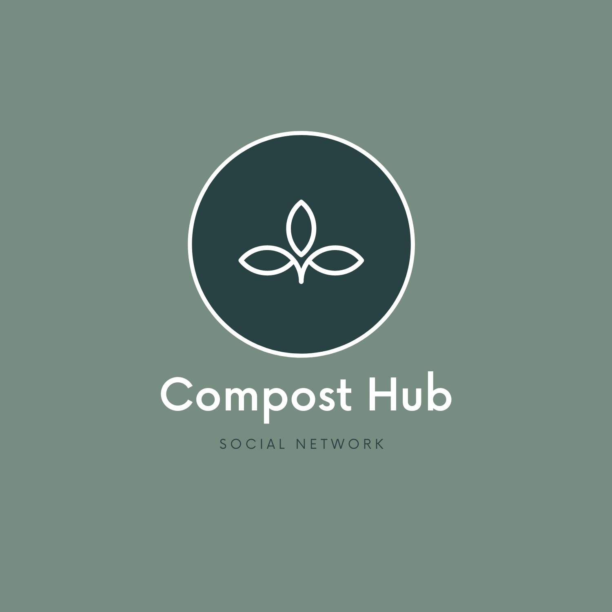

<div id="top"></div>
<!--
*** Thanks for checking out the Best-README-Template. If you have a suggestion
*** that would make this better, please fork the repo and create a pull request
*** or simply open an issue with the tag "enhancement".
*** Don't forget to give the project a star!
*** Thanks again! Now go create something AMAZING! :D
-->


<!-- PROJECT SHIELDS -->
<!--
*** I'm using markdown "reference style" links for readability.
*** Reference links are enclosed in brackets [ ] instead of parentheses ( ).
*** See the bottom of this document for the declaration of the reference variables
*** for contributors-url, forks-url, etc. This is an optional, concise syntax you may use.
*** https://www.markdownguide.org/basic-syntax/#reference-style-links
-->
[![Contributors][contributors-shield]][https://github.com/pmcc12/CompostApp/graphs/contributors]
[![Forks][forks-shield]][https://github.com/pmcc12/CompostApp/network/members]
[![Stargazers][stars-shield]][https://github.com/pmcc12/CompostApp/stargazers]
[![Issues][issues-shield]][https://github.com/pmcc12/CompostApp/issues]


<!-- PROJECT LOGO -->
<br />
<div align="center">
  <a href="https://github.com/pmcc12/CompostApp/blob/developement/main_logo.png">
    
  </a>

<h3 align="center">Compost Hub</h3>

  <p align="center">
    Social networking app that connects supplier, producers, and consumers of organic household waste.
    <br />
    <a href="https://alder-molybdenum-3c4.notion.site/API-Endpoint-Documentation-b0ef42ce0b82401885111ea98d95a263"><strong>Explore the docs »</strong></a>
    <br />
    <br />
  </p>
</div>


<!-- TABLE OF CONTENTS -->
<!-- <details>
  <summary>Table of Contents</summary>
  <ol>
    <li>
      <a href="#about-the-project">About The Project</a>
      <ul>
        <li><a href="#built-with">Built With</a></li>
      </ul>
    </li>
    <li>
      <a href="#getting-started">Getting Started</a>
      <ul>
        <li><a href="#prerequisites">Prerequisites</a></li>
        <li><a href="#installation">Installation</a></li>
      </ul>
    </li>
    <li><a href="#usage">Usage</a></li>
    <li><a href="#roadmap">Roadmap</a></li>
    <li><a href="#contributing">Contributing</a></li>
    <li><a href="#license">License</a></li>
    <li><a href="#contact">Contact</a></li>
    <li><a href="#acknowledgments">Acknowledgments</a></li>
  </ol>
</details> -->


<!-- ABOUT THE PROJECT -->
<!-- ## About The Project

[![Product Name Screen Shot][product-screenshot]](https://example.com)

Here's a blank template to get started: To avoid retyping too much info. Do a search and replace with your text editor for the following: `github_username`, `repo_name`, `twitter_handle`, `linkedin_username`, `email`, `email_client`, `project_title`, `project_description`

<p align="right">(<a href="#top">back to top</a>)</p> -->


## Built With

### Frontend
* [Next.js](https://nextjs.org/)
* [React.js](https://reactjs.org/)

### Backend


<p align="right">(<a href="#top">back to top</a>)</p>


<!-- GETTING STARTED -->
## Getting Started
There's a few things you need to do to get started:

### Prerequisites

- npm

- API Keys

  Stripe & Stripe webhook, AWS S3 bucket, AWS SES

- Database
you need to install postgres local database & put it in the server local .env

### Installation

- Clone the repo
   ```sh
   git clone https://github.com/pmcc12/CompostApp.git
   ```

### Client
1. Install NPM packages
   - CompostApp/client
   ```sh
   npm i
   ```
  
4. Enter your API key & credentials in your local `.env`

### Server
1. Install NPM packages
   - In CompostApp/server
   ```sh
   npm i
   ```
2. Install Prisma CLI
    -  `npx prisma generate`
    -  Create table (Do Migration)
        
        `npx prisma migrate dev --name "init" --preview-feature`
        
    
3. Create Amazon S3 config
    
    Put in the `.env`
    
4. Stripe checkout
    
    Put in the `.env`
    
5. Stripe webhooks
    
    Use `ngrok` to make [localhost](http://localhost) accessible
    
    put the webhook endpoint & registered it in stripe dashboard webhook
    
    Choose:
    
    - charge.succeeded
    - checkout.session.completed
    
    Put in the `.env`

7. To use Email ses,
    
    Put the aws config in `.env`
    
    put the `email_source` & `email_ReplyToAddresses` in `.env`
    
8. `npm start`
9. Optional
    
    if you want to deploy the backend in AWS Lambda
    
    `sls deploy`
    
    You must provide the:
    
    `serverless config credentials — provider aws — key <your-access-key-id> — secret <your-secret-key>`


<p align="right">(<a href="#top">back to top</a>)</p>


<!-- USAGE EXAMPLES -->
<!-- ## Usage

Use this space to show useful examples of how a project can be used. Additional screenshots, code examples and demos work well in this space. You may also link to more resources.

_For more examples, please refer to the [Documentation](https://example.com)_

<p align="right">(<a href="#top">back to top</a>)</p> -->


<!-- CONTRIBUTING -->
## Contributing

Contributions are what make the open source community such an amazing place to learn, inspire, and create. Any contributions you make are **greatly appreciated**.

If you have a suggestion that would make this better, please fork the repo and create a pull request. You can also simply open an issue with the tag "enhancement".
Don't forget to give the project a star! Thanks again!

1. Fork the Project
2. Create your Feature Branch (`git checkout -b feature/AmazingFeature`)
3. Commit your Changes (`git commit -m 'Add some AmazingFeature'`)
4. Push to the Branch (`git push origin feature/AmazingFeature`)
5. Open a Pull Request

<p align="right">(<a href="#top">back to top</a>)</p>


